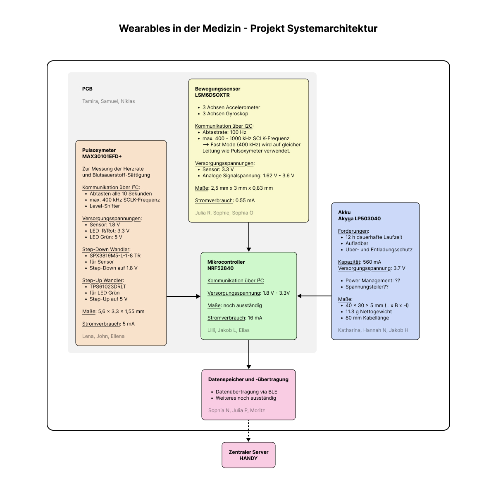

# Wearables-Project

## Systemarchitektur

### Bauteilanforderungen an Akku 

## 🗓️ Deadlines

##### ➡️ 17.03.2026 (Intern)
Bauteilauswahl der verschiedenen Gruppen + eine Person, welche diese vorstellt

##### ➡️ 31.03.2026 (Extern)
Funktionalität, Architektur 
Abgabe eines Dokuments von Projektleitungsgruppe (nach Absprache mit Gesamgruppe) 

##### ➡️ 12.04.2026 (Intern)
Schaltpläne Fertigstellung

##### ➡️ 27.04.2026 (Intern)
PCB Fertigstellung

##### ➡️ 30.04.2026 (Extern)
Schaltplan und Dokumentation (Verifikation Konzept, Cybersicherheit Risiken und Konzept) 
Jede Gruppe gibt zwei Dokumente ab für ihr jeweiliges funktionales Modul:
- Schaltplan in KiCad + Bill of Materials (Teile müssen in Stock sein und JEDES Bauteil muss aufgeführt werden) 
- Dokument für Messverfahren für Verifikation und Herstellung, 2 Seiten max.)

Projektleitungsgruppe gibt ein zusätzliches Dokument bzgl. Cybersicherheit Risiken und Konzept ab 

##### ➡️ 26.05.2026 (Extern)
Wearable Challenge Tag (Alle Gruppen führen die Tests gleichzeitig)

## System Anforderungen
- am Handgelenk tragbares Wearable (Wearable zu definieren!) mit: 
  - 12 Stunden ununterbrochene Funktionalität
  - wiederaufladbare Akku (Ladebuchse muss nicht mit im Gehäuse eingeplant werden, Drahtloses laden nicht notwendig)
    - Spannungsregler notwendig? 
  - Datenübertragung zum zentrale Server
    - welche Übertragung wird genutzt? sowohl intern als auch extern= 
  - Pulsmessung
  - Bewegung Messung (min. 3 Achsen Accelerometer, min. 3 Achsen Gyroskop)
  - IPX7 Schutzklasse
  - kein User interface
  - kein Display
  - 1 Jahr Kundengarantie -> muss nach 1 Jahr immer noch 12 Stunden Laufzeit haben
  - IMU soll 100Hz Abtastrate haben
  - alle Daten müssen am Ende des Tages MIT timestamps auf dem Server sein (Sekundär Batterie muss NICHT implementiert werden), es kann angenommen werden dass Server ständig verbunden ist, aber es muss sicher gestellt werden dass keine Blockierungen passieren
  - Pulsoxy/ HR soll alle 10 Sekunden Herzrate messen & neuen Wert speichern

## Glossar
Wearable Definition:
Wearables bezeichnen Geräte, die folgende Kriterien erfüllen. Sie können nicht nur nicht obsturktiv am Körper getragen werden, sie schränken also keine Körperfunktionen ein, sondern können auch jederzeit durch die benutzende Person an- und abgelegt werden. Zudem bedienen sie sich der Sensorik, digitalen Datenverabreitung und der Kommunikation.

## Abgabe Anforderungen
- Schaltplan in KiCad designen
  - gewählte Bauteile müssen in KiCad einen Footprint besitzen
  - Testpunkte mitbedenken
  - Namen / Kennzeichnungen müssen mit Schaltplänen anderer Gruppen zusammenpassen 
- Bill of Materials:
  - Bauteile müssen kaufbar sein (keine Lieferzeiten von 12 Wochen o.ä.)
  - Eindeutige ID, Wert, Größe/Gehäuse und Bestellcode angeben
  - Beispiel BOM 
   

## Gruppen einteilung
#### Akku Gruppe 
Jakob, Hannah N., Katharina
#### Bewegungssensor Gruppe 
Julia R., Sophie, Sophia Ö. 
#### Pulsoxy/HR Gruppe 
Lena, John, Ellena
#### Projektleitunsgruppe 
Sophia G., Hauke, Marie, Hannah K. 
#### PCB Gruppe (unterstützt Akku Gruppe) 
Tamira, Niklas, Samuel 
#### Mikrokontroller Gruppe 
Jakob, Elias, Lilli 
#### Datenverarbeitungsgruppe 
Sophia N., Pietschie, Moritz 
